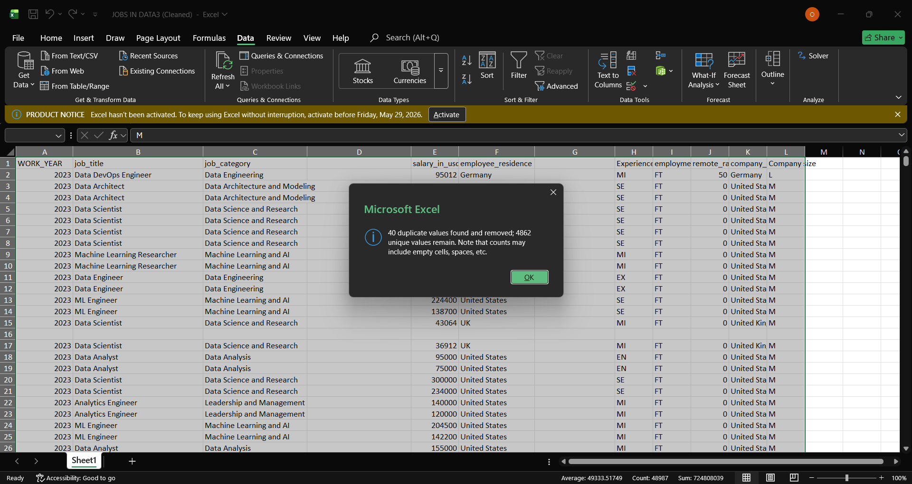
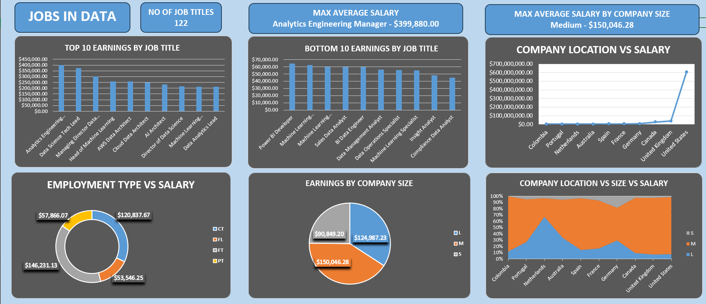
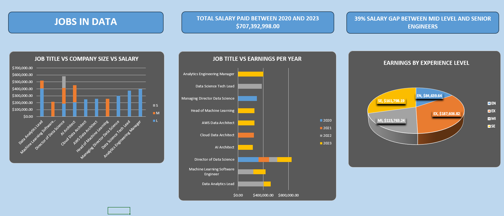

# JOBS IN DATA (2020-2023)
---
An Excel data cleaning, visualization and analysis of jobs in data from 2020 till 2023

## 📋 Executive Summary
* Analyzed a dataset of jobs in data from 2020 till 2023 containing over 4,000 transaction records to identify recruitment and salary trends. I discovered that The visual dashboard derived from this clean baseline exposes critical strategic pillars: the dramatic increase of salaries within the post-pandemic macroeconomy; with a 43% increase in salaries in 2023 compared to 2020, a massive cash premium allocated to Machine Learning and AI engineering categories, and structural differences in compensation behaviour where mid-sized operations routinely outbid legacy tier-1 enterprises for high-impact talent, with 20% difference.

---

## 🛠️ Tech Stack & Tools
* **Data Cleaning & Analysis:** Excel
* **Visualization & Reporting:** Excel

---

## 🧼 1. Data Cleaning & Transformation
The original dataset contained 4,902 raw data rows. Through structural data workflows, exactly 44 records were flagged, isolated, and expunged due to integrity violations, leaving 4,858 clean transactions for visualization.

* **Missing Value Resolution:** Checked for and deleted blank cells and columns. Null entries found in non-critical categorizations were flagged and filled with appropriate data; a single row missing an employment type classification was isolated and resolved to avoid downstream aggregation skips.
* **Row Pruning & Deduplication:** Exact row-level duplicates resulting from reporting overflows were dropped.
* **Data Type Standardization:** Converted salary column to currency($) and the year column to text to avoid aggregation.

---

## 📊 2. Data Visualization & Dashboard Design
Executive Performance Dashboard

 
 

---

## 🧠 3. Analytical Insights & Core Outputs

### 1 Top Ten Earnings by Job Title
Specialized data managers and machine learning infrastructure leads command a steep financial premium over generalist tracks, with Analytics Engineering Managers leading the dataset at an average of $399,880. They are closely followed by Data Science Tech Leads ($375,000) and Managing Directors of Data Science ($300,000), highlighting that highly customized engineering roles receive top-tier compensation.

### 2 Bottom Ten Earnings by Job Title
The financial floor of the dataset is occupied by roles with lower technical barriers or higher susceptibility to automation, primarily consisting of administrative and general tracking positions. Compliance Data Analysts sit at the absolute bottom with an average salary of $45,000, while Insight Analysts ($47,977) and Machine Learning Specialists ($55,000) represent the baseline entry-tier for operational tracks.

### 3 Employment Type Vs Salary 
Corporate budget depth and strategic commitment heavily dictate compensation across different contract types, with Full-Time (FT) positions securing the highest premium at an average salary of $146,231 to ensure long-term retention. Contractual (CT) roles maintain a strong baseline at $120,837, whereas Part-Time (PT) and Freelance (FL) arrangements offer significantly lower earning potential at $57,800 and $53,500 respectively.

### 4 Earnings by Company Size
Corporate scale does not scale linearly with compensation; instead, mid-sized firms (M) offer the most competitive wages in the dataset, averaging $150,046. This comfortably outpaces large enterprises (L), which average $124,987, while small operations (S) lag behind at $90,849 due to clear capitalization constraints.

### 5 Company Location Vs Salary
Regional salary power is highly concentrated around local capital markets and digital maturity, resulting in specialized, isolated peaks like Qatar at $300,000 for niche tech hubs. On a broader global scale, the primary market powerhouses are led by the United States and Canada, which boast strong average salaries of $157,919 and $139,971 respectively.

### 6 Company Location Vs Size Vs Salary
When evaluating geography and corporate scale simultaneously, data indicates that the global compensation premium seen in mid-sized firms is not universal, but is instead overwhelmingly driven by North American mid-sized companies aggressively expanding their hiring presence.

### 7 Job Title Vs Company Size Vs Salary
The scaling of specialized skillsets varies sharply by organizational size, as evidenced by AI Architects pulling massive averages of $246,500 within nimble mid-sized companies. In contrast, large legacy operations tend to lag behind, enforcing flat compensation caps for equivalent, highly technical titles.

### 8 Job Title Vs Earnings per Year
The data market has matured rapidly out of its early experimental phases into highly standardized operational tracks, leading to aggressive financial growth. This structural compounding across key technical roles saw average market salaries leap from $105,800 in 2020/2021 to $152,100 by 2023.

### 9 Experience Level vs. Earnings
A professional's career lifecycle yields high compounding value, starting from an entry-level (EN) ecosystem baseline of $84,639. Compensation scales up by 36.7% for mid-level (MI) developers ($115,763), accelerates sharply for senior specialists (SE) to $161,798, and ultimately peaks at the executive (EX) ceiling of $187,606.

---

## 🚀 4. Strategic Recommendations
What should the business actually do with this information?

1.	Focus on building things, not just collecting data: The market doesn't care much about just gathering data anymore; it rewards companies that actually use data to build smart tools and AI. Shift your team's focus from general data analysis to building these high-value systems.
2.	Watch out for mid-sized startups: When hiring or trying to keep your staff, don't just look at big corporations. Mid-sized, fast-growing startups are your biggest competitors for talent because they can offer flexible cash bonuses. If you are a larger company, win them over with job stability and long-term stock options.
3.	Hire local, senior full-time staff: Big-tech companies aren't always the highest payers anymore. For the best value, focus your hiring on local, experienced full-time professionals. They provide the most predictable results for what they cost.
